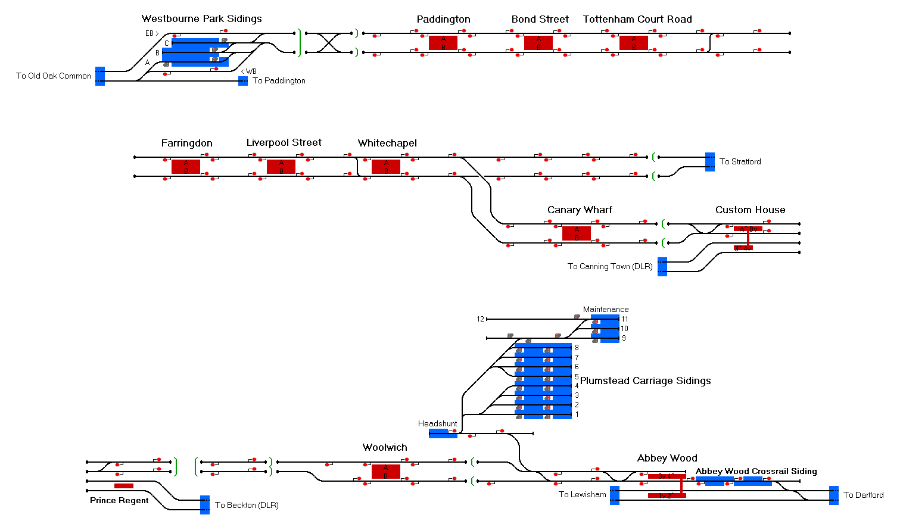

# Elizabeth Line
The soon to be opened Elizabeth Line, based upon it's opening in 2022. Current timetable based upon the trial running in Early 2022.


| An image of the route in BMP format within the `Images` folder.|
| At least one complete timetable within the `Program_Timetables` folder.|
| At least one session for each timetable, with preferred directions set placed in the `Sessions` folder.|
| Documentation describing background to the route and operations tips within the `Documentation` folder. This can include any maps/useful information as well. The recommended format for the documentation is PDF to be universally accessible, an optional template has been added for ease.|
| Update the metadata file `Metadata/<route-name>.toml` which will be generated by the CI within the repository. Descriptions of recognised keys are given in the section below.|
| The table below, image of the state of the map, and the data sources should be updated regularly. In the table the statuses of not completed, completed and needs verification are represented by the icons:<br>:heavy_check_mark: :x: :grey_question:|

| 📝 **Metadata File Format** |
|---|
| The following outlines the keys of the `Metadata/<route-name>.toml` to be included within the repository. A starting file will be generated by the CI system after a commit is pushed.<br>Inclusion of the `rly_file` and `ttb_files` keys are paramount, as they connect the metadata file with the simulation itself and can help confirm the expected route is installed, as well as provide a bridge between a route and its timetables. If there are any sessions these should be specified with the `ssn_files` key. <br><br>**NOTE**: Personal information such as email or social network handles are not included under the definitions of a route metadata file. An example completed metadata file can be found [here](https://github.com/Railway-Op-Sim/BE-Anterwerpen-Centraal/blob/master/Metadata/Antwerpen_Centraal.toml)|

|**key**|**optional**|**description**|
|---|---|---|
|   `name`| |title of the simulation project                                                      |
|   `display_name`   | ☑️ |   alternative name (name that would be used for display purposes)                      |
|  `description`    | ☑️  |  a brief line summary of the project                                                  |
|  `rly_file`       |         |      `.rly` filename of the simulation itself                                                    |
|   `ttb_files`       |     |         list of timetable `.ttb`. files                                                              |
|   `ssn_files`        | ☑️    |        list of session `.ssn` files                                                                |
|   `doc_files`        |     |        list of documentation files (`.md`, `.txt`, `.pdf`)                                 |
|   `img_files`        | ☑️  |        list of image files (`.png`, `.bmp`)                                                |
|   `graphic_files`    | ☑️  |        list of graphic files (`.png`, `.jpg`, `.bmp`)                                      |
|   `country_code`     |     |        if factual simulation alpha-2 country code (see https://www.iban.com/country-codes) else `FN`  |
|   `year`             | ☑️|  year simulation takes place if applicable                                            |
|   `factual`         |      |        is the simulation based on a real or fictional network (true/false)                  |
|   `difficulty`     |   ☑️     |       estimate of the simulation difficulty out of 5                                       |
|   `author`          |        |      leading developer/author (must match ROS site author name)                           |
|   `contributors`     | ☑️|  other contributing authors as list (must match ROS site author names)                |
|   `version`          |   | semantic version of the form `MAJOR.MINOR.PATCH` (first release usually `1.0.0` but can be date `2021.12.1`)|
|   `release_date`     |   |  release date in the form `YYYY-MM-DD`                                                |
|   `minimum_required` | ☑️ | minimum required version of ROS, if simulation contains features not present in older releases. |

### Metadata File Example
```toml
name = "Simulation of Antwerp south"
description = "Simulation covering the lines from Antwerpen Centraal to St. Katelijne-Waver/Lier"
display_name = "Antwerpen Centraal"
country_code = "BE"
rly_file = "Antwerpen_Centraal.rly"
ttb_files = ["Antwerpen_Centraal_2021.ttb"]
ssn_files = ["Antwerpen_Centraal_2021.ssn"]
doc_files = ["README.md"]
img_files = ["Antwerpen_Centraal_2021.bmp"]
year = 2021
factual = true
difficulty = 3
author = "Krizar"
contributors = ["Albert Ball"]
version = "1.0.0"
release_date = "2021-10-10"
```

|✏️ **Releasing the Simulation**|
|---|
|When you are ready to publish your simulation to [Railway Operation Simulator](https://railwayoperationsimulator.com/), create a release on the GitHub repository. This will trigger the CI system to create a zip file which you can then use for the upload. Give the CI a couple of minutes, releases can be found on the sidebar for the repository. You will know if it has completed as the release will be called `<github-repo-name> Release <version-number>`, e.g. `Railway-Op-Sim/UN-Template Release v1.0.0`|




## Current Status

| Stage         | Status        |
| ------------- |:-------------:|
| Track Plan     | :heavy_check_mark: |
| Signalling      | :heavy_check_mark:      |
| Naming | :heavy_check_mark:      |
| Speed Limits | :heavy_check_mark: |
| Distances | :heavy_check_mark: |
| Timetable | :x: |
| Documentation | :x: |


## Data Sources

- [Crossrail Timetable Rules](https://content.tfl.gov.uk/ttpr-2021.pdf)
- [RailCam](https://railcam.uk/diagrams/x_anydiag.php?di=Crossrail1)
- [RealTimeTrains (22nd Feb 2022)](https://www.realtimetrains.co.uk/search/detailed/gb-nr:PDX?stp=WVS&show=all&order=wtt)
